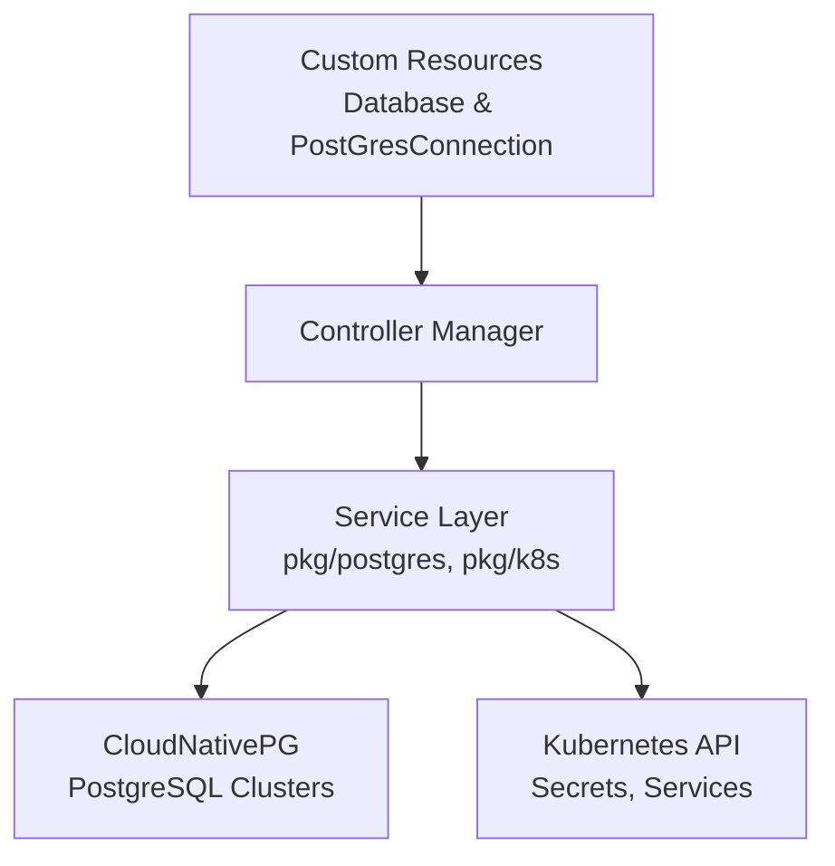
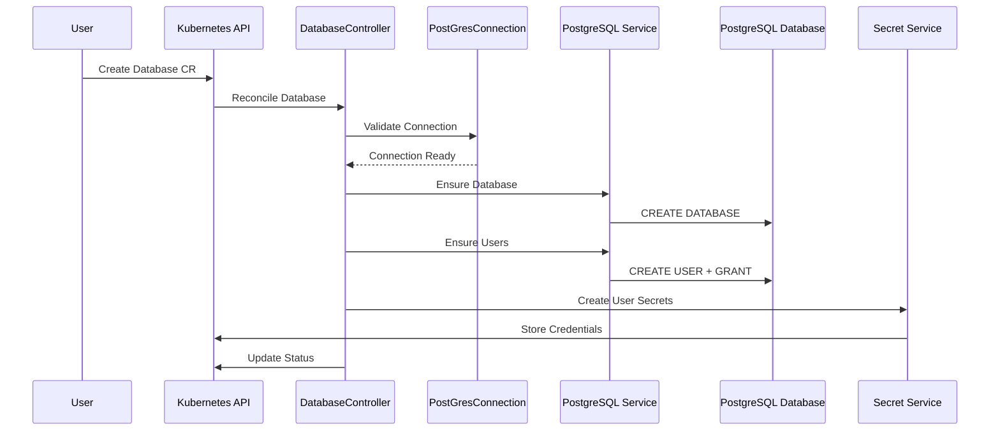

# PostgreSQL Operator Architecture

This document describes the architecture and design decisions of the PostgreSQL Operator for CloudNativePG.

## Overview

The pg-operator is a Kubernetes operator that simplifies database and user management for CloudNativePG (CNPG) PostgreSQL clusters. It provides a declarative API for creating databases and managing users with fine-grained permissions.

## Architecture Components

### Core Components



### 1. Custom Resource Definitions (CRDs)

#### PostGresConnection
- Represents a connection to a CloudNativePG cluster
- Handles authentication and connection validation
- Supports cross-namespace cluster access
- Auto-discovers CNPG secrets and services

#### Database
- Represents a PostgreSQL database to be created
- References a PostGresConnection for cluster access
- Manages database users and their permissions
- Automatically generates Kubernetes secrets for users

### 2. Controller Layer (`internal/controller/`)

The controller layer has been significantly simplified through refactoring:

**Before Refactoring:**
- `database_controller.go`: 361 lines with embedded business logic
- `postgresconnection_controller.go`: 211 lines with connection handling

**After Refactoring:**
- Controllers reduced to ~100-150 lines each
- Business logic extracted to service packages
- Consistent error handling through shared utilities

#### DatabaseReconciler
- Orchestrates database creation workflow
- Delegates to service layer for PostgreSQL operations
- Manages Kubernetes resource lifecycle

#### PostGresConnectionReconciler
- Validates connections to CNPG clusters
- Updates connection status and readiness
- Handles credential discovery and validation

### 3. Service Layer (`pkg/`)

The service layer provides reusable business logic components:

#### PostgreSQL Services (`pkg/postgres/`)

**Client (`client.go`)**
- Centralized database connection management
- Connection pooling and timeout handling
- Credential resolution from Kubernetes secrets

**Database Service (`database.go`)**
- Database creation and existence checking
- Configurable owner and encoding settings
- Idempotent operations

**User Service (`user.go`)**
- User creation and permission management
- Secure password generation
- Comprehensive permission system (CONNECT, CREATE, SELECT, etc.)

#### Kubernetes Services (`pkg/k8s/`)

**Secret Service (`secrets.go`)**
- User credential secret generation
- Controller reference management
- Consistent secret naming conventions

**Status Service (`status.go`)**
- Unified status updates for all resources
- Kubernetes condition management
- Consistent requeue strategies

#### Utilities (`pkg/utils/`)

**Error Handling (`errors.go`)**
- Consistent error handling patterns
- Kubernetes-aware error classification
- Retry logic for transient failures

**Password Generation (`password.go`)**
- Cryptographically secure password generation
- Multiple generation strategies
- Configurable password complexity

## Data Flow

### Database Creation Flow



## Configuration Structure

The configuration has been simplified from 33 YAML files to approximately 20:

### RBAC Consolidation
- **Before**: 17 separate role files
- **After**: 3 consolidated files
  - `user-roles.yaml`: User management permissions
  - `controller-roles.yaml`: Controller and system permissions  
  - `role-bindings.yaml`: All role bindings

### Metrics Configuration
- **Before**: 2 separate patch files
- **After**: 1 consolidated `metrics-config.yaml`

## Security Model

### Authentication
- Integrates with CNPG's built-in authentication
- Supports both superuser and app-user credentials
- Automatic credential discovery from CNPG secrets

### Authorization
- Fine-grained RBAC for different user types
- Controller runs with minimal required permissions
- User secrets are automatically scoped to databases

### Network Security
- SSL/TLS connections to PostgreSQL (configurable)
- Network policies for metrics endpoint protection
- Service mesh compatibility

## Deployment Patterns

### Standard Deployment
```yaml
# Single cluster, same namespace
apiVersion: postgres.silverswarm.io/v1
kind: PostGresConnection
metadata:
  name: local-connection
spec:
  clusterName: "my-postgres"
```

### Cross-Namespace Deployment
```yaml
# Multi-tenant, shared cluster
apiVersion: postgres.silverswarm.io/v1
kind: PostGresConnection
metadata:
  name: shared-connection
  namespace: app-namespace  
spec:
  clusterName: "shared-postgres"
  clusterNamespace: "postgres-system"
```

### High-Security Deployment
```yaml
# Enhanced security configuration
apiVersion: postgres.silverswarm.io/v1
kind: PostGresConnection
metadata:
  name: secure-connection
spec:
  clusterName: "secure-postgres"
  sslMode: "verify-full"
  useAppSecret: true  # Use less-privileged credentials
```

## Monitoring and Observability

### Metrics
- Prometheus-compatible metrics endpoint
- HTTPS with certificate-based authentication
- Connection health and reconciliation metrics

### Logging
- Structured logging with consistent format
- Kubernetes event integration
- Error context preservation

### Health Checks
- Controller readiness and liveness probes
- PostgreSQL connection validation
- CNPG integration health monitoring

## Development and Testing

### Package Structure
```
pkg/
├── postgres/     # PostgreSQL operations
├── k8s/          # Kubernetes helpers  
└── utils/        # Shared utilities

internal/
├── controller/   # Kubernetes controllers
└── testutil/     # Test utilities

scripts/
├── dev-setup.sh  # Development environment
├── test.sh       # Comprehensive testing
└── release.sh    # Release automation
```

### Testing Strategy
- Unit tests for service layer components
- Integration tests with real PostgreSQL
- E2E tests with CNPG clusters in kind
- Automated coverage reporting

## Design Decisions

### Why Service Layer Architecture?
1. **Separation of Concerns**: Controllers focus on Kubernetes lifecycle, services handle business logic
2. **Testability**: Service components can be unit tested independently
3. **Reusability**: Services can be used across multiple controllers
4. **Maintainability**: Smaller, focused components are easier to understand and modify

### Why Consolidated RBAC?
1. **Reduced Complexity**: Fewer files to manage and understand
2. **Consistency**: Unified permission model
3. **Maintenance**: Easier to update permissions across all resources

### Why PostgreSQL Service Abstraction?
1. **Connection Management**: Centralized connection pooling and timeout handling
2. **Error Handling**: Consistent PostgreSQL error translation
3. **Security**: Secure credential management and SSL configuration
4. **Future Compatibility**: Easy to extend for different PostgreSQL features

## Extension Points

The architecture supports several extension patterns:

### Adding New Database Operations
1. Extend the PostgreSQL service interfaces
2. Add new methods to existing services
3. Update controllers to use new operations

### Adding New Resource Types  
1. Define new CRDs in `api/v1/`
2. Create dedicated controllers
3. Reuse existing service layer components

### Custom Authentication
1. Extend the `Client` service
2. Add new credential resolution strategies
3. Support additional secret formats

## Performance Considerations

### Connection Pooling
- Reuse database connections across reconciliations
- Configurable connection timeouts
- Proper connection cleanup

### Reconciliation Efficiency
- Idempotent operations avoid unnecessary work
- Intelligent requeue strategies based on error types
- Status caching to reduce API calls

### Resource Management
- Minimal RBAC permissions
- Efficient Kubernetes client usage
- Proper resource cleanup and finalizers

This architecture provides a solid foundation for managing PostgreSQL databases declaratively while maintaining simplicity, security, and extensibility.